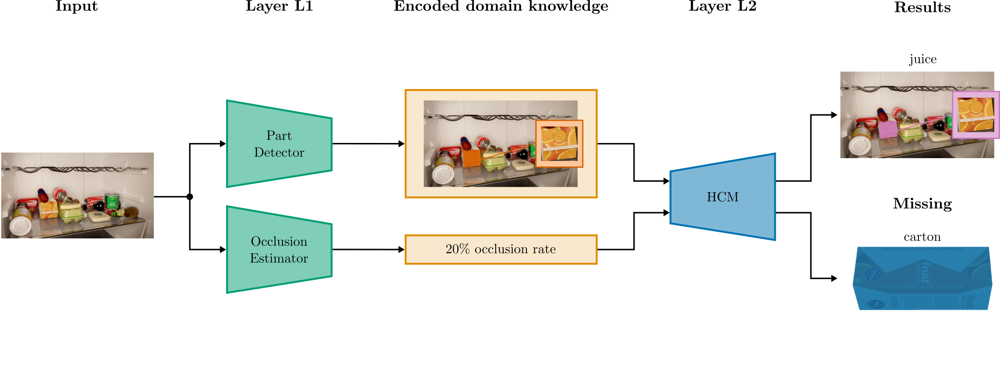

# Human-Centered Deep Compositional Model for Handling Occlusions

***Gregor Koporec, Janez Perš***

This repository contains code, data, and instructions for experiments appeared in the paper "Human-Centered Deep Compositional Model for Handling Occlusions".

## Paper Abstract



Despite their powerful discriminative abilities, Convolutional Neural Networks (CNNs) lack the properties of generative models. This leads to a decreased performance in environments where objects are poorly visible. Solving such a problem by adding more training samples can quickly lead to a combinatorial explosion, therefore the underlying architecture has to be changed instead. This work proposes a Human-Centered Deep Compositional model (HCDC) that combines low-level visual discrimination of a CNN and the high-level reasoning of a Hierarchical Compositional model (HCM). Defined as a transparent model, it can be optimized to real-world environments by adding compactly encoded domain knowledge from human studies and physical laws. The new FridgeNetv2 dataset and a mixture of publicly available datasets are used as a benchmark. The experimental results show the proposed model is explainable, has higher discriminative and generative power, and better handles the occlusion than the current state-of-the-art Mask-RCNN in instance segmentation tasks.

## Getting Started with Datasets

<!--### Requirements-->

### FridgeNetv2 Dataset


FridgeNetv2 Dataset belong to the [Gorenje, d. o. o.](http://www.gorenje.com/) and is licensed under [Gorenje Terms of Use](/Gorenje%20Terms%20of%20Use.md). The dataset is available only for research purposes under proper user agreements. If you are a qualified researcher and you would like a copy of the dataset for your work, please fill out [this form](doc/HCDC%20Research%20Collection%20User%20License%20Agreement.docx) and send it to Gregor at gregor.koporec@gorenje.com.

Once accepted, we will send you the link to our download link.

If you have not received a response within a week, it is likely that your email is bouncing - please check this before sending repeat requests.

### PCMix Dataset


PCMix dataset is publicly available dataset that consists of Pascal VOC 2010, MS COCO, Car Parts, and Pascal-Part dataset. Each dataset has the corresponding terms of use that must be respected upon usage:

- **Pascal VOC 2010**: [Flickr Terms & Conditions of Use](https://www.flickr.com/help/terms)
- **MS COCO**: [Terms of Use](https://cocodataset.org/#termsofuse)
- **Car Parts Dataset**: [CC BY 4.0](https://creativecommons.org/licenses/by/4.0/)
- **Pascal-Part Dataset**: [Unknown license](http://roozbehm.info/pascal-parts/pascal-parts.html)

Original dataset was created in the following way:

- **train**
  - Person category from Pascal Parts trainval dataset
  - Car category from Car Parts train dataset
- **val**
  - Person category from Pascal Parts val dataset
  - Car category from Car Parts train dataset
- **test**
  - Person category from MS COCO 2017 val dataset occluded by Pascal VOC 2010 occluders (coco_ocln folder)
  - Car category from Car Parts test dataset occluded by Pascal VOC 2010 occluders

Augmented dataset was created by augmenting the original dataset.

#### 1. Prerequisites

##### Pascal VOC 2010

1. Download and extract Pascal VOC train and validation data (1.3 GB) to `pascal_voc` folder.

   ```bash
   wget http://host.robots.ox.ac.uk/pascal/VOC/voc2010/VOCtrainval_03-May-2010.tar
   tar -xvf VOCtrainval_03-May-2010.tar -C pascal_voc
   ```

##### MS COCO

1. Download MS COCO 2017 validation images (1 GB). Follow the instructions from <https://cocodataset.org/#download>.

2. Create a separate folder `coco_ocln` with the following structure:

   ```text
   coco_ocln
   |  annotations
   |  test
   |  train
   |  val
   ```

3. To occlude images with `person` category, change `configs/dataset/base_occlude_coco_format.yaml` and `configs/dataset/occlude/occlude_coco.yaml` according to your use case. Then create occluded dataset by `python tools/dataset/dataset.py --cfg configs/occlude/occlude_coco.yaml`

#### 2. Car Parts Dataset

1. Download [Car Parts Dataset](https://github.com/dsmlr/Car-Parts-Segmentation) (28 MB)

2. Create a separate folder `car_parts_dataset` with the following structure:

   ```text
   car_parts_dataset
   |
   |--orig
   |  |  annotations
   |  |  JPEGImages
   |
   |--pcformat
   |  |  annotations
   |  |  test
   |  |  train
   |  |  val
   |  
   |--ocln
      |  annotations  
      |  test
      |  train
      |  val
   ```

3. Move/copy all images from `Car-Parts-Segmentation/testset/JPEGImages` and `Car-Parts-Segmentation/trainingset/JPEGImages` to `car_parts_dataset/orig/JPEGImages`.

4. Move/copy all annotations from `Car-Parts-Segmentation/testset/` and `Car-Parts-Segmentation/trainingset` to `car_parts_dataset/orig/annotations`.

5. Open `notebooks/dataset/correct_carparts.ipynb` notebook. Correct paths according to your directory structure. Run all cells to correct the dataset annotations and split training data to train and validation set. Finally, link, move, or copy train and validation data and accompanying annotations to `car_parts_dataset/ocln` folder.

6. Correct configuration files `configs/dataset/base_occlude_coco_format.yaml` and `configs/dataset/occlude/occlude_carparts.yaml` according to your use case.  Run `python tools/dataset/dataset.py --cfg configs/dataset/occlude/occlude_carparts.yaml` to occlude test set by using *Pascal VOC 2010*.

#### 3. Pascal-Part Dataset

1. Download and extract Pascal-Part Dataset training and validation set (78 MB) to `pascal_voc/VOCdevkit/VOC2010`

   ```bash
   wget http://roozbehm.info/pascal-parts/trainval.tar.gz
   tar -xzvf trainval.tar.gz -C pascal_voc/VOCdevkit/VOC2010
   ```

2. Change `configs/dataset/base_pascalparts_person.yaml`, `configs/dataset/pascalparts/person_train.yaml`, and `configs/dataset/pascalparts/person_val.yaml` according to your use case. Run `./tools/dataset/pascalparts_person_dset.sh` to create `Pascal Parts Person Dataset` in PCMix format.

3. Run `notebooks/dataset/subset_pascalparts_person.ipynb` notebook to get validation subset.

#### 4. Merging and Creating Final PCMix Dataset

1. Open `notebooks/dataset/join_to_grmix.ipynb` notebook and update paths according to your use case. Run all cells in order to merge all modified datasets into original PCMix Dataset.

2. Run `tools/dataset/grmix_aug.sh` script in order to create PCMix Dataset with offline augmentations.

#### 5. Inspecting Proper Dataset Creation

Every dataset created by the above procedure can be inspected using `notebooks/dataset/inspect_dset.ipynb` notebook. Additionally, *Pascal-Part Person dataset* can be further inspected by using `notebooks/dataset/inspect_pascalparts_person_dset.ipynb` and *PCMix dataset* can be inspected by using `notebooks/dataset/inspect_grmix_dataset.ipynb` notebook.

## Getting Started with the models and API

The models and the API belong to the [Gorenje, d. o. o.](http://www.gorenje.com/) and is licensed under [Gorenje Terms of Use](/Gorenje%20Terms%20of%20Use.md). The dataset is available only for research purposes under proper user agreements. If you are a qualified researcher and you would like a copy of the dataset for your work, please fill out [this form](doc/HCDC%20Research%20Collection%20User%20License%20Agreement.docx) and send it to Gregor at gregor.koporec@gorenje.com.

Once accepted, we will send you the link to our download link.

If you have not received a response within a week, it is likely that your email is bouncing - please check this before sending repeat requests.

## COCO Dataset Format Specification

COCO dataset is JSON file, which has dictionary as a top value. Each dictionary attribute has a collection if items (nested dictionaries.) Basic structure of the dataset is as follows:

```json
dataset{
    "info": info,
    "images": [image],
    "annotations": [annotation],
    "licenses": [license],
    "categories": [category]
}
```

**Note**:

- All ID values start from `1`.
- Urls are relate paths from dataset root directory
- Additional attributes not found in originial COCO dataset are tagged by `*`

### Info record

Info is a dictionary, containing metadata about the dataset.

```json
info{
    "year": int,
    "version": str,
    "description": str,
    "contributor": str,
    "url": str,
    "date_created": datetime,
}
```

`url` is always empty in gorenje.

### Image record

Image is a dictionary containing metadata about the images.

```json
image{
    "id": int,
    "width": int,
    "height": int,
    "file_name": str,
    "license": int,
    "flickr_url": str,
    "coco_url": str,
    "date_captured": datetime,
    *"bimg_id": int,
    *"occupancy": float,
    *"iou": float
}
```

Additional attribute explanation:

- `file_name`: image filename or basename. It doesn't contain any folders or subfolders.
- `flickr_url`: Always empty string.
- `coco_url`: Path to image file relative to dataset folder.
- `bimg_id`: Blender image id.
- `occupancy`: Occupancy of the shelf as 3D format metric.
- `iou`: Occupancy as intersection over union. 2D format metric.

### License record

License is a dictionary containing metadata about the license for images in the dataset. For gorenje 'Gorenje Copyright' license is used. It is situated in root folder of the dataset and named `LICENSE`.

```json
license{
    "id": int,
    "name": str,
    "url": str,
}
```

`url` is path to license file relative to root dataset folder. It should always be `./LICENSE`.

### Annotation record

Annotation metadata in a dictionary form:

```json
annotation{
    "id": int,
    "image_id": int,
    "category_id": int,
    "segmentation": RLE or [polygon],
    "area": float,
    "bbox": [x,y,width,height],
    "iscrowd": 0 or 1,
    *"is_occluded": bool,
    *"occluders": [int],
    *"spawn_id": int
}
```

Additional attribute explanation:

- `segmentation`: Always as [polygon] in JSON file.
- `iscrowd`: Always `0`.
- `is_occluded`: Whether the annotated object is occluded.
- `occluders`: List of annotation ids that are occluders to this annotation.
- `spawn_id`: Spawn ID from Blender rendering task.

### Category record

Category metadata in a dictionary form:

```json
category{
    "id": int,
    "name": str,
    "supercategory": str,
}
```

<!--## Usage TODO-->

## Known issues

If you use too big BATCH_SIZE for pascalparts dataset (e.g., 10) you will get the error
`multiprocessing.pool.MaybeEncodingError: Error sending result: '<imgaug.augmentables.batches.UnnormalizedBatch object at 0x7fd7dbde7588>'. Reason: 'error("'i' format requires -2147483648 <= number <= 2147483647",)'`. A bit of googling indicates that this error can appear when a single batch exceeds 1GB of size in memory. It should be fixed by decreasing the batch size.

## Citation

If you make use of this repository, please cite the following reference in any publications:

```bibtex
@Unpublished{Koporec2022,
  author  = {Gregor Koporec and Janez Per{\v{s}}},
  note    = {2nd revision in Pattern Recognition},
  title   = {Human-Centered Deep Compositional Model for Handling Occlusions},
  year    = {2022},
  journal = {Pattern Recognition},
  pages   = {35},
}
```

## Acknowledgement

This work was supported by Gorenje, d. o. o. and the Slovenian Research Agency (ARRS) [research projects J2-9433 and J2-2506 and research program P2-0095].

## Support

For support contact:

Gregor Koporec - gregor.koporec@gorenje.com

## License

Copyright (C) 2022 GORENJE d. o. o. - All Rights Reserved
